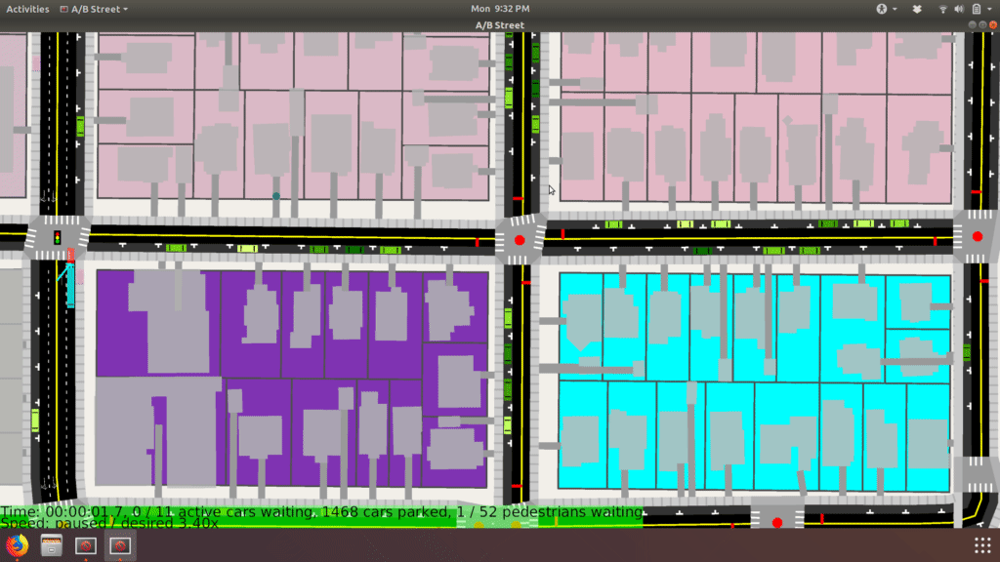

# A/B Street

A/B Street is a game exploring how small changes to a city affect the movement
of drivers, cyclists, transit users, and pedestrians.

This is not an officially supported Google product. Google owns the copyright
to this work, but is otherwise unaffiliated with it.

This is currently an experimental project. Please contact me at
<dabreegster@gmail.com> if you're interested in the premise of this game.

## Data source licensing

A/B Street binary releases contain pre-built maps that combine data from:

* OpenStreetMap (https://www.openstreetmap.org/copyright)
* King County metro (https://www.kingcounty.gov/depts/transportation/metro/travel-options/bus/app-center/terms-of-use.aspx)
* City of Seattle GIS program (https://www.opendatacommons.org/licenses/pddl/1.0/)
* https://github.com/seattleio/seattle-boundaries-data (https://creativecommons.org/publicdomain/zero/1.0/)
* USGS SRTM
