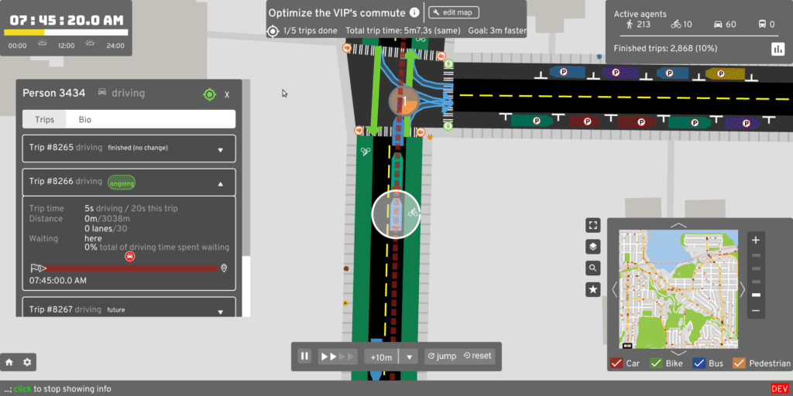

# A/B Street

Ever been on a bus stuck in traffic, wondering why there are cars parked on the
road instead of a bus lane? A/B Street is a game exploring how small changes to
a city affect the movement of drivers, cyclists, transit users, and pedestrians.

- Play on
  [Windows](https://github.com/dabreegster/abstreet/releases/download/v0.1.42/abstreet_windows_v0_1_42.zip),
  [Mac](https://github.com/dabreegster/abstreet/releases/download/v0.1.42/abstreet_mac_v0_1_42.zip),
  [Linux](https://github.com/dabreegster/abstreet/releases/download/v0.1.42/abstreet_linux_v0_1_42.zip),
  or [read all instructions](docs/INSTRUCTIONS.md) (new releases every Sunday)
- [build from source](docs/dev.md) (new changes daily)

Find a problem:

Make some changes:

Measure the effects:

## Documentation for developers

- [Developer guide](docs/dev.md)
- [Map model](docs/articles/map/article.md)
- [Traffic simulation](docs/articles/trafficsim/article.md)
- [Rust implementation notes](docs/articles/rust/article.md)
- [Running A/B Street in a new city](docs/new_city.md)
- Presentations
  - April 2020 Rust meetup:
    [recording](https://www.youtube.com/watch?v=chYd5I-5oyc),
    [slides](https://docs.google.com/presentation/d/1nUodhr42eppB2E2eMAnuTkMhIVuHnN7_6i6V6MA028c/edit?usp=sharing)
  - [Feb 2020 traffic sim](https://docs.google.com/presentation/d/181so6bWkGsPzpc-mI72CQffthMKMVzFPAkYxIyzgfAs/edit?usp=sharing)
  - [Oct 2019 Traffic sim and current challenges](https://docs.google.com/presentation/d/1PJRFoXmJAyenkqHIwo48zxqu1LSH6pc7XKSzhyC1raw/edit?usp=sharing)
  - [Oct 2019 Map construction](https://docs.google.com/presentation/d/1cF7qFtjAzkXL_r62CjxBvgQnLvuQ9I2WTE2iX_5tMCY/edit?usp=sharing)

## Features

- The map
  - A detailed rendering of Seattle from OpenStreetMap and King County GIS data,
    including sidewalks, on-street parking, bike lanes, bus-only lanes, turn
    lanes, buildings, and bus stops.
  - Intersections governed by stop signs and traffic signals, with default
    signal timings heuristically inferred. Hand-tuned geometry to reasonably
    model Seattle's strangest intersections.
  - You can adjust lane types, stop signs, and traffic signals, and reverse
    lanes.
- The traffic
  - Individual cars, buses, bikes, and pedestrians move through the map.
  - Most trips are multi-modal -- for example, a pedestrian exits a building,
    walks a few blocks over to their parked car, drives somewhere, looks for
    parking, and walks to their final destination.
  - A realistic set of trips -- how many people go from building 1 to building 2
    at some time using some form of transport -- based on
    [PSRC's Soundcast](https://www.psrc.org/activity-based-travel-model-soundcast)
    model.
- The gameplay
  - Start in sandbox mode, exploring the map, watching traffic patterns,
    following individual agents, looking for problems.
  - Jump to edit mode, where you can convert some on-street parking to bus lanes
    and adjust traffic signals to try to fix some problem.
  - Try your change in A/B test mode, running two traffic simulations
    side-by-side. Explore how individual agents finish their trips faster or
    slower, and compare aggregate results about different groups of traffic.
  - Attempt a predefined challenge with particular objectives, like speeding up
    certain bus routes or designing a full bike network.

### Roadmap and contributing

See the [roadmap](docs/roadmap.md) for current work, including ways to help. If
you want to bring this to your city or if you're skilled in design, traffic
simulation, data visualization, or civic/government outreach, please contact
Dustin Carlino at <dabreegster@gmail.com>. Follow
[r/abstreet](https://www.reddit.com/r/abstreet/) for weekly updates or
[@CarlinoDustin](https://twitter.com/CarlinoDustin) for occasional videos of
recent progress.

## Project mission

If you fix some traffic problem while playing A/B Street, my ultimate goal is
for your changes to become a real proposal for adjusting Seattle's
infrastructure. A/B Street is of course a game, using a simplified approach to
traffic modeling, so city governments still have to evaluate proposals using
their existing methods. A/B Street is intended as a conversation starter and
tool to communicate ideas with interactive visualizations.

Why not leave city planning to professionals? People are local experts on the
small slice of the city they interact with daily -- the one left turn lane that
always backs up or a certain set of poorly timed walk signals.
[Laura Adler](http://www.govtech.com/data/SimCities-Can-City-Planning-Mistakes-Be-Avoided-Through-Data-Driven-Simulations.html)
writes:

> "Only with simple, accessible simulation programs can citizens become active
> generators of their own urban visions, not just passive recipients of options
> laid out by government officials."

Existing urban planning software is either proprietary or hard to use. A/B
Street strives to set the accessibility bar high, by being a fun, engaging game.

## Credits

Core team:

- Dustin Carlino (<dabreegster@gmail.com>)
- [Yuwen Li](https://www.yuwen-li.com/) (UX)

Active contributors:

- Orestis Malaspinas (<orestis.malaspinas@hesge.ch>) (pandemic modeling)
- Christopher Klein (game design)

Others:

- Logo by [Ryan Pierson](https://www.ryandpierson.com/)
- Graphic design advice from [Starcat Games](http://starcatgames.com/),
  [Daniel Huffman](https://somethingaboutmaps.wordpress.com/),
  [Brian Prince](http://thebaprince.com/)
- Lightning-fast pathfinding thanks to
  [fast_paths](https://github.com/easbar/fast_paths) by Andreas Barth
  (<easbar.mail@posteo.net>)
- Hackathon drop-ins from [Democracy Lab](https://www.democracylab.org/) events
- [CUGOS](https://cugos.org/) and [Julian Michael](http://julianmichael.org/)
  have been great sounding boards for ideas since the beginning
- In-game character faces adapted from
  [Anokhee Jandhyala](https://github.com/anokhee/visual-synthesizer)

Data:

- Special thanks to all [OpenStreetMap](https://www.openstreetmap.org/about)
  contributors!
- [King County GIS](https://www.kingcounty.gov/services/gis.aspx)
- [Seattle Open Data](https://data.seattle.gov/)
- [Puget Sound Regional Council](https://www.psrc.org/)
