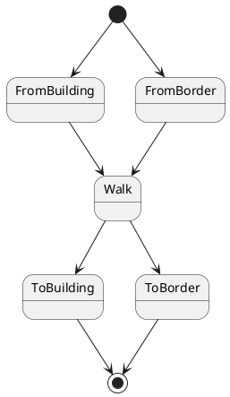
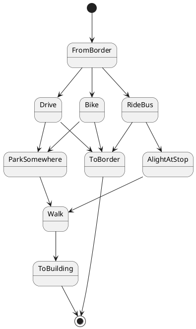
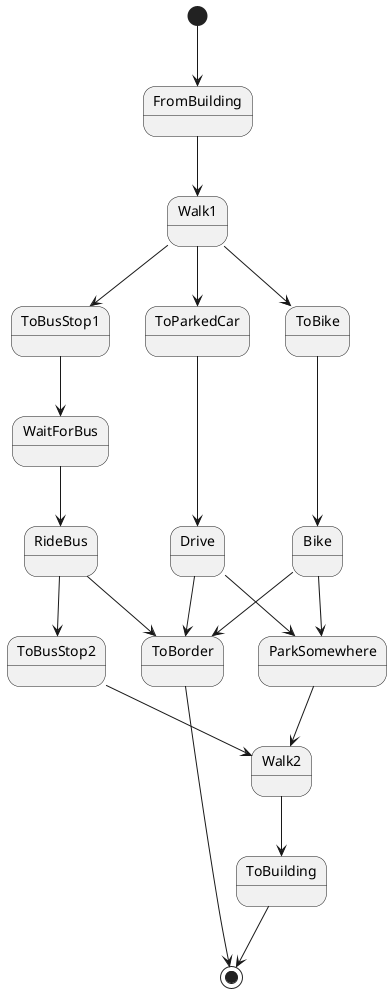

# Multi-modal trips

A single trip consists of a sequence of `TripLegs` -- walking, operating a
vehicle (car or bike), and riding the bus. Depending whether a trip begins or
ends at a border or building, there are many combinations of these sequences.
This is a way to categorize them into three groups. I'm not sure it's the
simplest way to express all the state transitons.

## Walking-only trips

## Trips starting from a border

## Trips starting from a building

## Spawning code overview

As of January 2021, starting a traffic simulation works like this:

1. Something creates a `Scenario`, which defines a bunch of people. Each person
   has a schedule of trips, carrying them between `TripEndpoints` via some
   `TripMode`, leaving at some `Time`.
2. When a scenario is instantiated, not much happens besides scheduling the trip
   to start at the appropriate time and filling out `TripInfo` in `TripManager`.
   Some state in `StartTripArgs` has to be plumbed forward in the
   `Command::StartTrip`.
3. When the command gets run later, `TripManager::start_trip` happens. The
   origin, destination, and mode flow through `TripSpec::maybe_new`.
4. `TripSpec::to_plan` further validates these and attempts to repair impossible
   plans. Each `TripSpec` is turned into a list of `TripLegs`.
5. Each `TripSpec` has its own initialization logic to kick off the first leg of
   the trip.
6. Most trips have multiple legs. When the first car, bike, or pedestrian
   reaches their goal, `TripManager` gets called with some sort of transition
   function to initiate the next leg of the trip, or declare the trip finished.
   These transition functions also record stats from that leg of the trip, like
   total blocked time.

What're the different `TripSpec` cases, and what `TripLegs` do they get turned
into?

- `VehicleAppearing`: Starts at a border. Drive, then maybe walk to the
  destination building.
- `SpawningFailure`: No trip legs; just create and immediately cancel the trip.
- `UsingParkedCar`: Starts at a building. Walk (to the parked car), drive, then
  maybe walk to the destination building (after parking again).
- `JustWalking`: Just walk between two buildings/borders.
- `UsingBike`: Starts at a building. Walk to the nearest bikeable lane, drive,
  then maybe walk to the destination building. (Note that starting a bike from a
  border uses `VehicleAppearing`.)
- `UsingTransit`: Walk, ride the bus, maybe walk again. No transfers yet; only
  rides one bus between two stops.

`TripManager` has a whole bunch of transition functions:

- `car_reached_parking_spot`: drive -> walk, unless the destination building is
  where we parked
- `ped_reached_parking_spot`: walk -> drive
- `ped_ready_to_bike`: walk -> bike
- `bike_reached_end`: bike -> walk
- `ped_reached_building`: walk -> done
- `ped_reached_bus_stop`: walk -> wait or ride bus
- `ped_boarded_bus`: waiting -> ride bus
- `person_left_bus`: riding bus -> walk
- `ped_reached_border`: walk -> done
- `transit_rider_reached_border`: ride bus -> done
- `car_or_bike_reached_border`: drive -> done

There are at least a few use cases motivating the cleanup of all of this
structure:

- Capping trips through congested areas. Sometimes this just changes the driving
  route, but sometimes it needs to cancel trips, convert driving trips to
  walking/transit, or delay the trip's start.
- Multiple public transit rides in a single trip, aka transferring
- Handling live map edits in the middle of a trip
