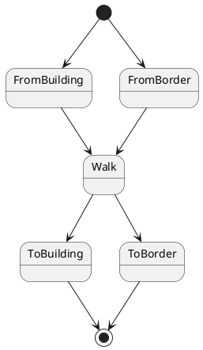
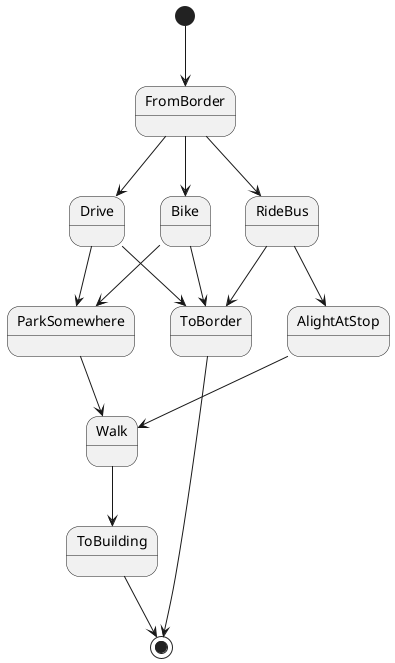
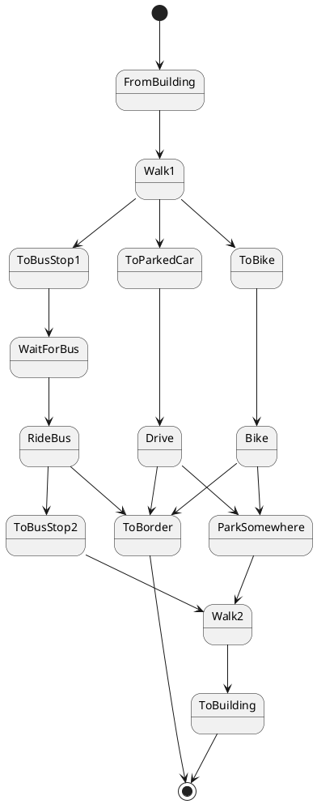

# Multi-modal trips

A single trip consists of a sequence of `TripLegs` -- walking, operating a
vehicle (car or bike), and riding the bus. Depending whether a trip begins or
ends at a border or building, there are many combinations of these sequences.
This is a way to categorize them into three groups. I'm not sure it's the
simplest way to express all the state transitons.

## Walking-only trips

## Trips starting from a border

## Trips starting from a building

