# A/B Street Features

Ever been on a bus stuck in traffic, wondering why there are cars parked on the
road instead of a bus lane? This article overviews the features of A/B Street, a
traffic simulation game set in Seattle. Players explore how small changes to
road layout and intersection rules affect the movement of pedestrians, drivers,
transit, and cyclists. The game's mission is to make it fun and simple for
anybody to test an idea to improve Seattle's traffic flow and, if the idea works
well, to communicate it to others.

<!--ts-->

- [A/B Street Features](#ab-street-features)
  - [Core gameplay](#core-gameplay)
  - [Map](#map)
    - [Lanes](#lanes)
    - [Intersections (geometry)](#intersections-geometry)
    - [Intersections (semantics)](#intersections-semantics)
    - [Boundaries](#boundaries)
    - [Buildings](#buildings)
  - [Traffic simulation](#traffic-simulation)
    - [Scale](#scale)
    - [Trips](#trips)
    - [A/B Tests](#ab-tests)
  - [Ongoing work](#ongoing-work)

<!-- Added by: dabreegster, at: Fri Apr 19 13:28:13 PDT 2019 -->

<!--te-->

## Core gameplay

Explore Seattle and observe how traffic currently flows.

After finding a problem, edit the map in a few ways:

- change lane types (example: replace on-street parking with a bus-only lane)
- change which roads stop or yield at a stop sign
- change the phases and timing of a traffic signal (example: ban a left turn or
  give it a dedicated phase)

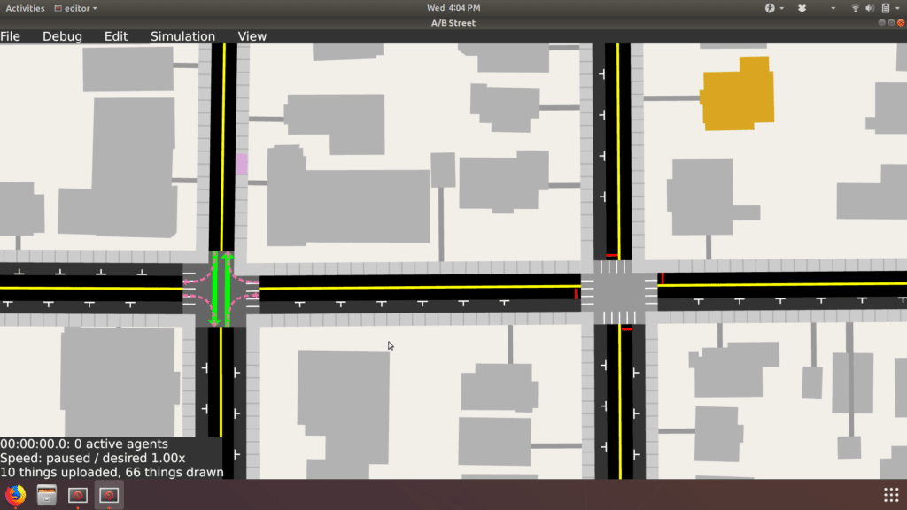

These are changes that could be prototyped in real life relatively cheaply. A/B
Street's purpose is to explore improvements to Seattle that we could try
tomorrow, not longer-term improvements like light rail extensions.

After making edits, you can see how the same traffic patterns behave. I'm
currently working on a way to easily visualize and compare results with and
without edits.

## Map

A/B Street generates a detailed map of Seattle from OpenStreetMap (OSM), King
County GIS, and a few other sources. It takes lots of processing to make a map
suitable for simulating traffic and that's visually appealing for a game. This
section describes some of these problems and solutions.

The portion of the code-base to transform and clean up the map are separate from
the traffic simulation. If you see another use for this map, contact me and
we'll figure out a format to export the data for your purposes. The code isn't
Seattle-specific; most things work if you only feed in OpenStreetMap data, and
plugging in another city's custom GIS data is probably not hard.

### Lanes

OSM models entire roads (crossing many intersections) coarsely, sometimes with
some metadata about lane restrictions.

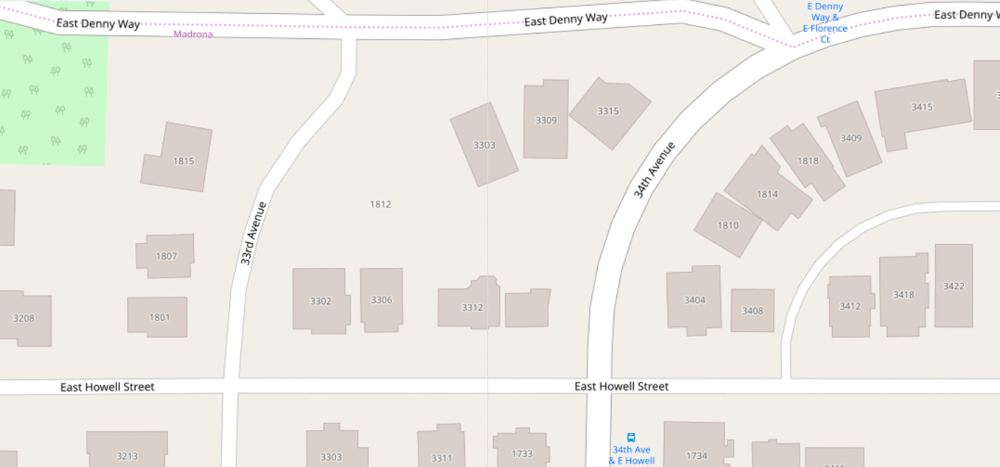

A/B Street breaks roads down into indidual lanes, automatically finding the
geometry from the OSM road's center-line. Lane types and the number of lanes
come from heuristics on the OSM metadata and from extra King County GIS
shapefiles. Types of lanes include:

- Regular driving lanes, usable by any vehicle
- Sidewalks for pedestrian movement, including bus stops and paths to buildings
- Bus- and bike-only lanes
- On-street parking lanes, with individual parking spots

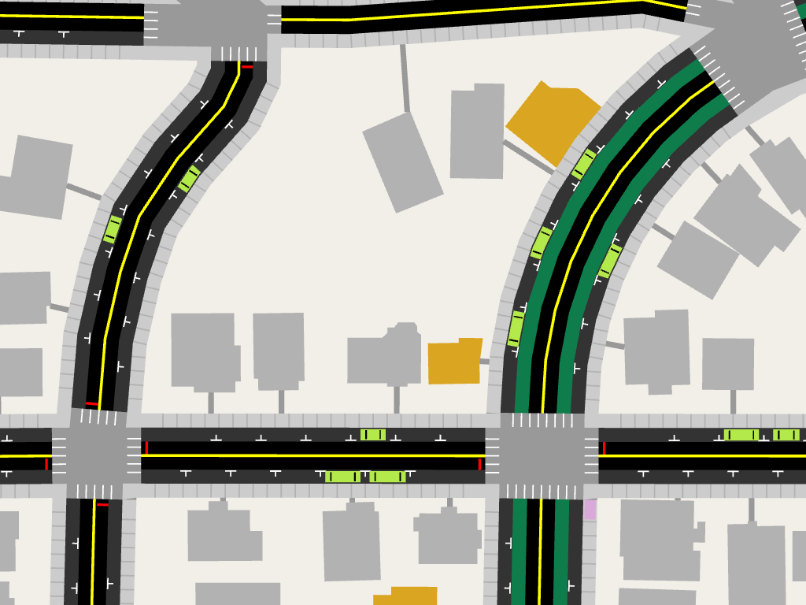

### Intersections (geometry)

OSM doesn't explicitly model intersections at all; some roads just share points.

In A/B Street, lanes and intersections have disjoint geometry.

This means that cars and pedestrians stop and queue at the correct position
before crossing an intersection.

The intersection geometry is calculated automatically, even for strangely-shaped
cases.

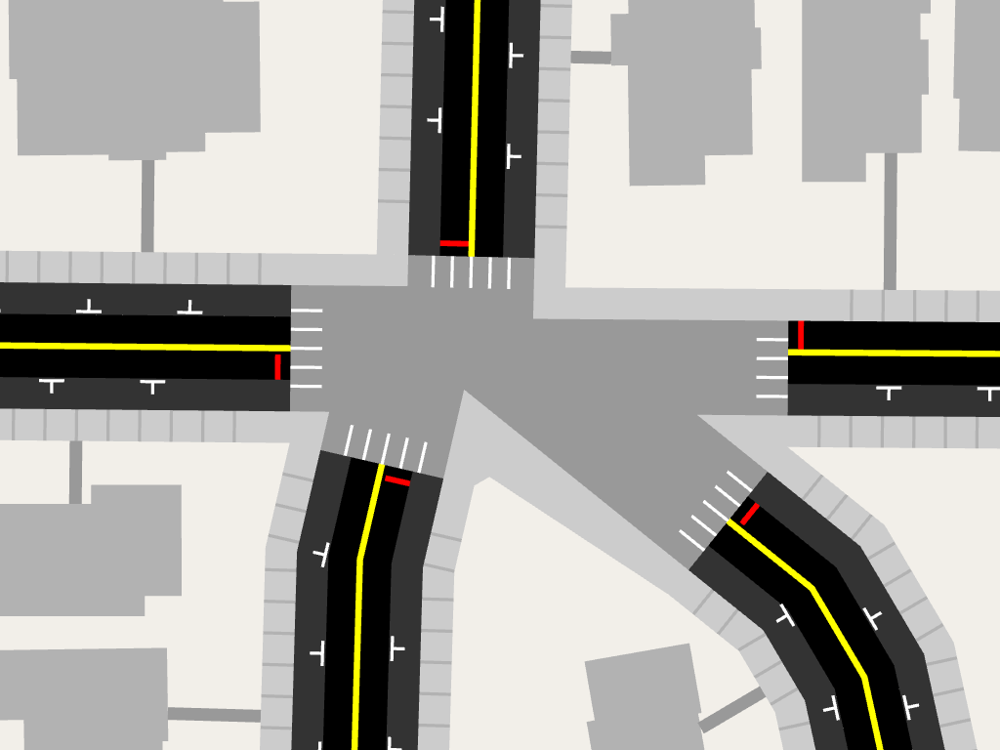

OSM ways often have many "intersections" very close together. These appear as
extremely short roads in A/B Street, which complicates traffic modeling.

These can be merged automatically, which works reasonably well sometimes.

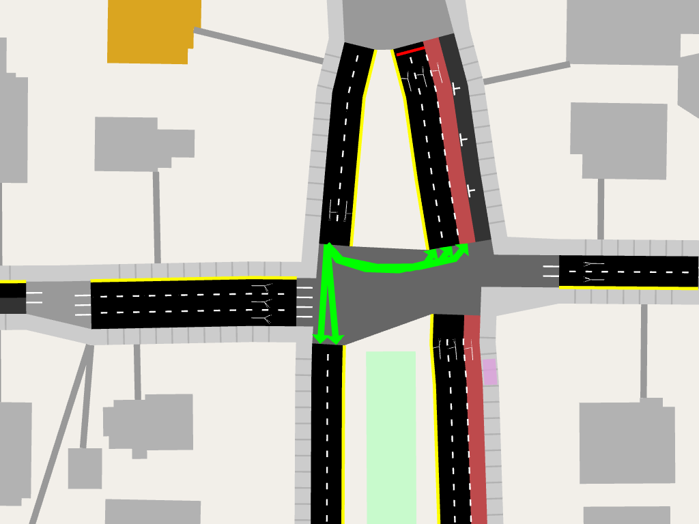

But some cases are very complex; this is Montlake and 520 without merging short
roads:

Montlake and 520 with merging doesn't look much better, so currently short road
merging is still disabled.

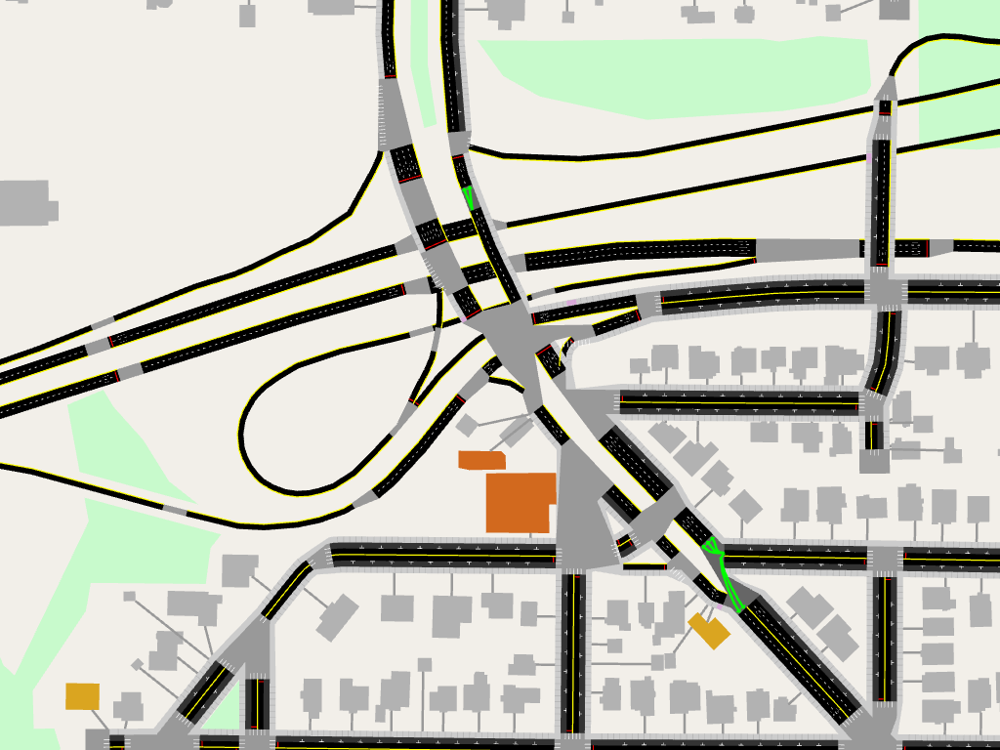

Some highway on-ramps in OSM are modeled with particularly unusual geometry,
overlapping an arterial road.

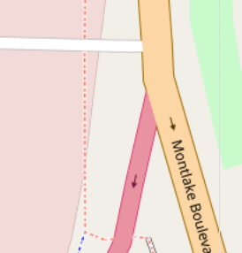

A/B Street detects and fixes these cases.

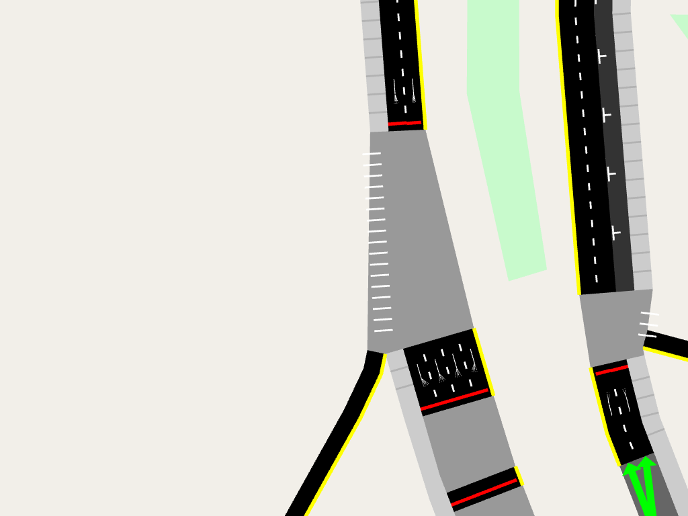

### Intersections (semantics)

A/B Street models each turn through intersections, connecting an incoming lane
to an outgoing lane. Some of these turns conflict, so cars can't perform them
simultaneously. Currently stop signs and traffic signals are modeled
(roundabouts act like all-way stops).

For stop-sign controlled intersections, the bigger road by default has priority.

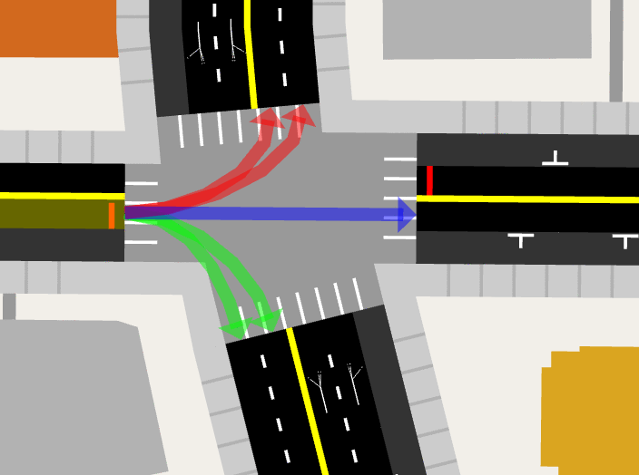

Intersections controlled by traffic signals have a default set of timed phases.
Players can edit these.

### Boundaries

How should the boundary of the map be handled? Without proper clipping, roads
and lakes go out-of-bounds, often with very strange, long roads to nowhere.

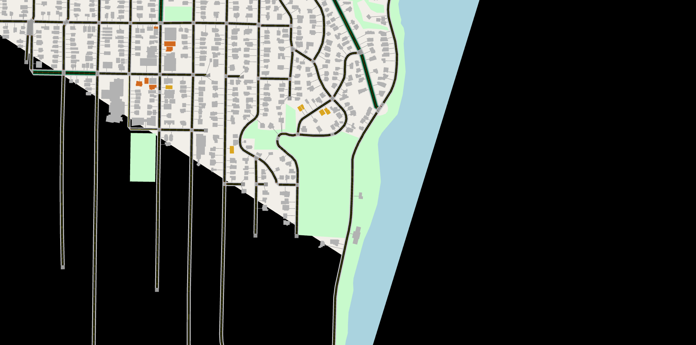

Proper clipping trims polygons to fit properly. Roads that cross the boundary
terminate at special border intersections, which can model traffic flowing into
or out of the map.

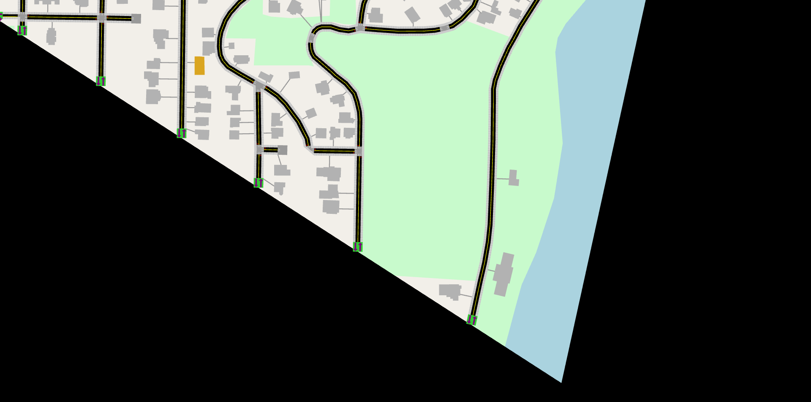

### Buildings

Light orange buildings are classified as residential, and dark orange as
commercial. Additional data from King County GIS reveals how many units some
apartments have. This could be used to generate a realistic number of trips
between residential and commercial areas.

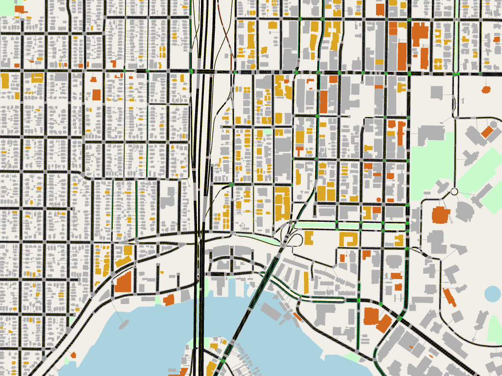

## Traffic simulation

A/B Street simulates the movement of individual agents:

- Cars move along lanes in a queue, only changing lanes at intersections.
- Buses are cars that cycle between bus stops, waiting at each one to unload and
  load passengers.
- Bikes are cars with a maximum speed limit.
- Pedestrians move bidirectionally along sidewalks. They can pass through each
  other; they don't queue or otherwise wait except at intersections. (Seattle
  has very few places where pedestrian movement is significantly bottlenecked
  due to other pedestrians.)

### Scale

A/B Street originally used a discrete timestep model, updating every agent every
0.1 seconds. This was unnecessarily complex and too slow, so it now uses a
discrete-event simulation, only updating agents when an interesting transition
happens. So while a car crosses a long lane, its exact position is only
interpolated for drawing, and a full update happens when the car reaches the
intersection or the end of the queued cars.

On my modest laptop (7th-gen Intel i5, 8GB RAM), I can simulate 10,000 agents on
the small map at 2x speed (one minute of game-time in 30 seconds). This
definitely needs improvement, but many interesting scenarios will be around this
scale. Simulating ~800,000 agents in all of Seattle is not a high priority; the
flow into and out of a smaller region can be modeled much more cheaply.

A/B Street has a time-travel mode, useful for rewinding to trace the source of a
bottleneck. This is a bit memory-intensive right now, but hasn't been updated to
take advantage of the discrete-event model.

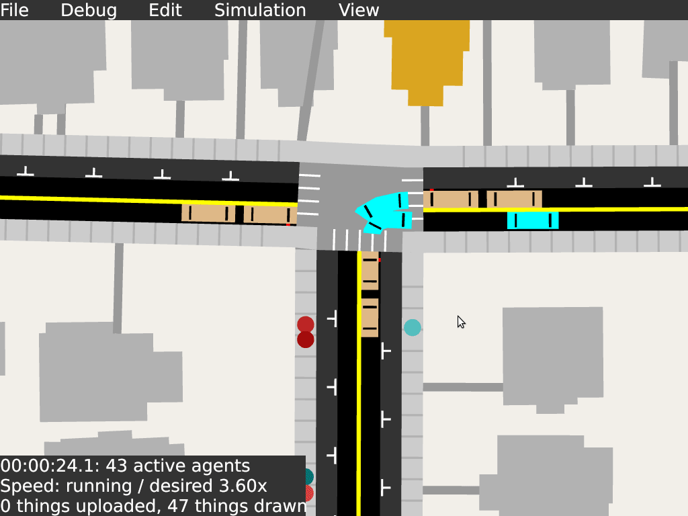

### Trips

Most trips are multi-modal. A pedestrian will appear at a building, travel down
the front path to the sidewalk, walk to a parked car they own or a bus stop,
start driving or riding, park or deboard, and walk to their final destination.
Bicycle trips have a fixed time to start or stop; this models how easy it is to
find bike parking in Seattle. In contrast, car parking is often scarce, so
drivers sometimes reach their destination, but start roaming around until they
find an available spot.

Trip generation -- travel from here to there, starting at this time, using a
car/bike/bus -- is currently very unrealistic. Players can manually define
groups of cars to spawn uniformly from somewhere within a region they outline,
but this is tedious. I'm actively looking for data sources (like the U.S census)
that'll give hints about where people live and work, to generate more realistic
demand data.

### A/B Tests

Traffic simulation is fully deterministic -- run exactly the same scenario twice
with the same version of the game, and you'll get the same results. Map edits
like adding or removing parking will change the initial conditions minimally (so
parked cars on unedited roads will usually not change). This lets players run
meaningful A/B tests, holding everything fixed except for a few tweaks to lanes
and intersections. Two simulations can be run in parallel, and there are tools
to visualize how individual agents are taking different paths or moving
faster/slower between the two runs.

## Ongoing work

A/B Street is not yet generally playable (but
[if you want to anyway](/docs/INSTRUCTIONS.md)...):

- The user interface to explore and edit the map is quite clunky.
- The pieces of the game -- editing the map, running a simulation, comparing
  results -- exist, but nothing is tied together yet in a game-like format.
- Data sources describing a realistic set of trips is missing; cars start and
  end at uniformly chosen places.
- Some important things aren't yet modeled: light rail, big bike trails like the
  Burke Gilman, ridesharing services, off-street parking lots and garages.

If you're interested in joining me and working on problems like these, please
get in touch. Funding is available. I also have half-finished articles with
technical details about how A/B Street works; just ask me to finish them.
Contact Dustin Carlino at <dabreegster@gmail.com>.
