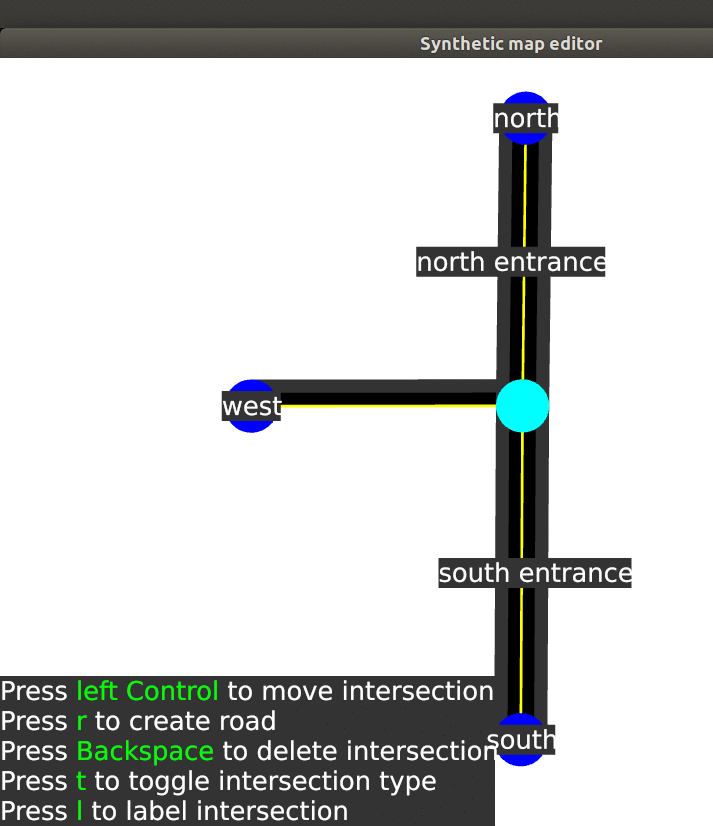
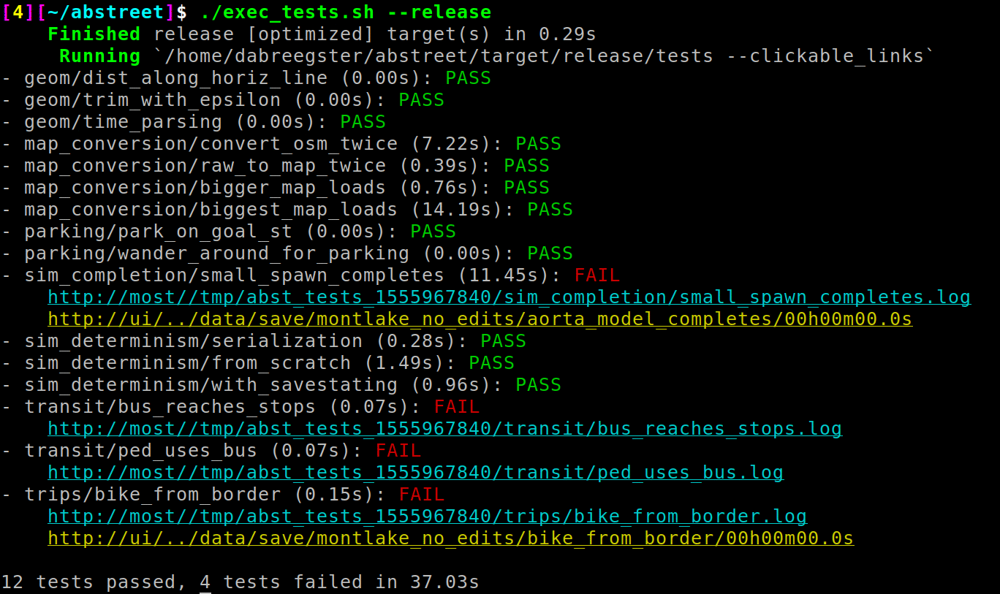

# Notes on Rust in A/B Street

This article describes parts of A/B Street's implementation that might be of
interest to the Rust community.

<!--ts-->

- [Notes on Rust in A/B Street](#notes-on-rust-in-ab-street)
  - [ezgui](#ezgui)
    - [Wizard and WrappedWizard](#wizard-and-wrappedwizard)
  - [Test runner](#test-runner)
  - [Grievances](#grievances)
  - [Appendix: Code organization](#appendix-code-organization)

<!-- Added by: dabreegster, at: Mon Apr 22 15:46:36 PDT 2019 -->

<!--te-->

## ezgui

After dabbling with the [existing GUI frameworks](http://areweguiyet.com/), I
wound up rolling my own, highly specialized to my use case. I originally used
Piston for underlying rendering, but I eventually switched to glium to stop
uploading so much geometry constantly. A/B Street only makes use of OpenGL 3
features and seems to work fine on Linux, Windows, and Mac. I don't have any
interest in Vulkan and the other newer things, but would love to also get A/B
Street running in the browser with WebGL or similar.

The ezgui library exposes a very simple, immediate-mode API. There's no messy
synchronization between application and GUI state; the application just asks
what events happened and says what to draw. There are basic widgets for text
entry and menus (with hotkeys). The application creates and stores these, passes
events along to them, and asks them to draw themselves. There's no layouting,
besides options to align individual widgets. A "canvas" (really a 2D camera)
handles basic panning and zooming.

[This](https://github.com/dabreegster/abstreet/blob/eae301ee1bde247be5a2b067f6a4eadaa68aa6e7/synthetic/src/main.rs)
is a simple example of usage. In the `event` method, the application checks its
own current state and, based on that, tests for relevant key-presses or clicks.
At the bottom of the screen, the current possible actions are shown with their
hotkey -- a king of cheap context-sensitive help function. `draw` is simple as
well; `ezgui` just exposes methods to draw a colored polygon and render text.
Large batches of geometry can be uploaded once, then cheaply redrawn later.

One mildly hilarious feature I have to mention is the
[screen capture](https://github.com/dabreegster/abstreet/blob/eae301ee1bde247be5a2b067f6a4eadaa68aa6e7/ezgui/src/widgets/screenshot.rs)
tool. I wanted a way to visually compare the Seattle maps I'm rendering, so I
can verify my changes to intersection layout code don't quietly butcher some
part of the map I'm not looking at. I tried a few different ways of coercing
glium to rendering to one big texture and saving to a file, but the result was
extremely slow unless I compiled in release mode (which is absolutely not an
option in the middle of debugging hairy geometry code). So instead, the
application can ask the `ezgui` layer to zoom in some amount, then take a bunch
of left-to-right, top-to-bottom steps over the canvas, calling an external
screenshot tool after each render. Sometimes the quick hack works perfectly.

I would consider cleaning up `ezgui` and publishing it as a generally usable
crate, except it's pretty crippled:

- the text rendering is very primitive; font size is fixed
- basic widgets like a scrolling text box, list with radio buttons, and tables
  are missing
- The imperative style makes it quite easy for different parts of the UI to
  stomp on each other, both using the same key. I'm not happy with how the
  paradigm scales, and want to experiment with other solutions before leading
  somebody else down the same hole I'm digging myself out of.

I'm still unsure if I'll keep making ezgui handle the growing complexity of A/B
Street's UI or if I'll try to adapt something else.

### Wizard and WrappedWizard

One trick I'm super proud of is the "wizard"-style dialogs for asking a series
of questions. Suppose you have a struct with a bunch of fields, like
[SpawnOverTime](https://github.com/dabreegster/abstreet/blob/eae301ee1bde247be5a2b067f6a4eadaa68aa6e7/sim/src/make/scenario.rs).
You want to prompt the user to fill out this struct, maybe even branching the
questions you ask based on previous answers.

My solution to this problem is
[edit_scenario](https://github.com/dabreegster/abstreet/blob/eae301ee1bde247be5a2b067f6a4eadaa68aa6e7/editor/src/plugins/edit/scenarios.rs),
which is called once per event (keypress). This code is extremely easy to write
and maintain; the complexity of the user prompts being filled out slowly over
the course of many `event()` and `draw()` calls is invisible. The
`WrappedWizard` works by storing confirmed responses and some widget
representing the current question. So the first many rounds, the `choose_string`
call for "What kind of edit" just defers to an ezgui Menu, which keeps its own
state about the current selected item. Once the Menu is done, WrappedWizard
stores the String response. The next time `choose_string` is called, it
immediately returns that answer, so `edit_scenario` makes it to the next step.
This is a simple way of simulating continuations. WrappedWizard returns `None`
for incomplete answers, and the `?` short-circuiting takes care of the rest.

## Test runner

Usability problems with the Rust test runner make it useless for my purposes.
When a test fails, I want STDOUT and STDERR in a log file, not inlined with
information on test runs. I sometimes want to surface a custom string in the
main test results that lets me quickly re-run a failed test with a GUI. So I
wrote
[this](https://github.com/dabreegster/abstreet/blob/eae301ee1bde247be5a2b067f6a4eadaa68aa6e7/tests/src/runner.rs)
to solve my needs, at least until https://github.com/rust-lang/rust/issues/50297
makes progress.

## Grievances

No surprises here: compile times suck. It's especially frustrating to add a few
lines to `geom` for debugging (not affecting any of the crate's external APIs),
then wait for the dependent crates `map_model`, `sim`, and `editor` to recompile
(or maybe just link again, but it sure is slow). It's also frustrating to
recompile all dependencies from scratch when I switch between compiling for
Linux and Windows.

There are a few crates with binary heaps for priority queues, but I couldn't
make any of them work with Serde, have deterministic behavior (so no hashing
underneath), and act as a min-heap instead of a max-heap.

Otherwise, Rust is amazing! Sometimes the borrow checker makes me express
something awkwardly, but mostly it's forced me to avoid bad ideas.

## Appendix: Code organization

If you're going to dig into the code, it helps to know what all the crates are.
The most interesting crates are `map_model`, `sim`, and `editor`.

Constructing the map:

- `convert_osm`: extract useful data from OpenStreetMap and other data sources,
  emit intermediate map format
- `gtfs`: simple library to just extract coordinates of bus stops
- `kml`: extract shapes from KML shapefiles
- `map_model`: the final representation of the map, also conversion from the
  intermediate map format into the final format
- `precompute`: small tool to run the second stage of map conversion and write
  final output

Traffic simulation:

- `sim`: all of the agent-based simulation logic
- `headless`: tool to run a simulation without any visualization

Graphics:

- `editor`: the GUI and main gameplay
- `ezgui`: an immediate-mode GUI library

Common utilities:

- `abstutil`: a grab-bag of IO helpers, timing and logging utilities, etc
- `geom`: types for GPS and map-space points, lines, angles, polylines,
  polygons, circles, durations, speeds
- `tests`: a custom test runner and some tests using it

Less interesting stuff:

- `analyze_code`: a static analysis attempt to construct a call-graph using
  `syn`
- `benchmark_pathfinding`: experimenting with an implementation of contraction
  hierarchies
- `debug_initialmap`: tool to debug intermediate form of maps, useful for
  intersection merging
- `halloween`: a toy to render maps in a "creepy" way
- `playground_gui`: interactive debugging of basic geometric algorithms
- `synthetic`: GUI for creating and editing "synthetic" maps from scratch
- `tmp_gfx`: glium experiments
- `viewer`: an experiment in making generic applications for manipulating maps
