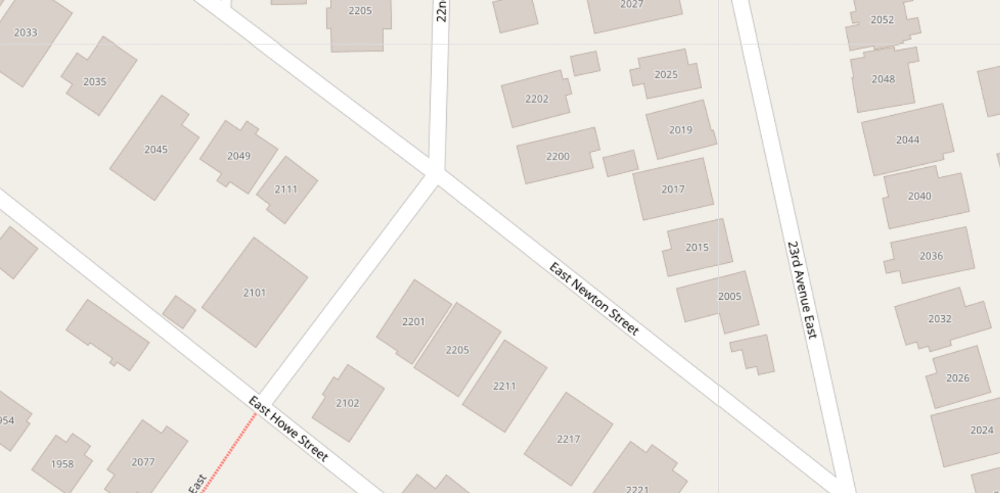
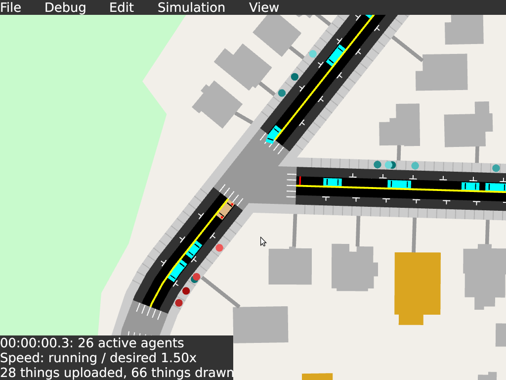
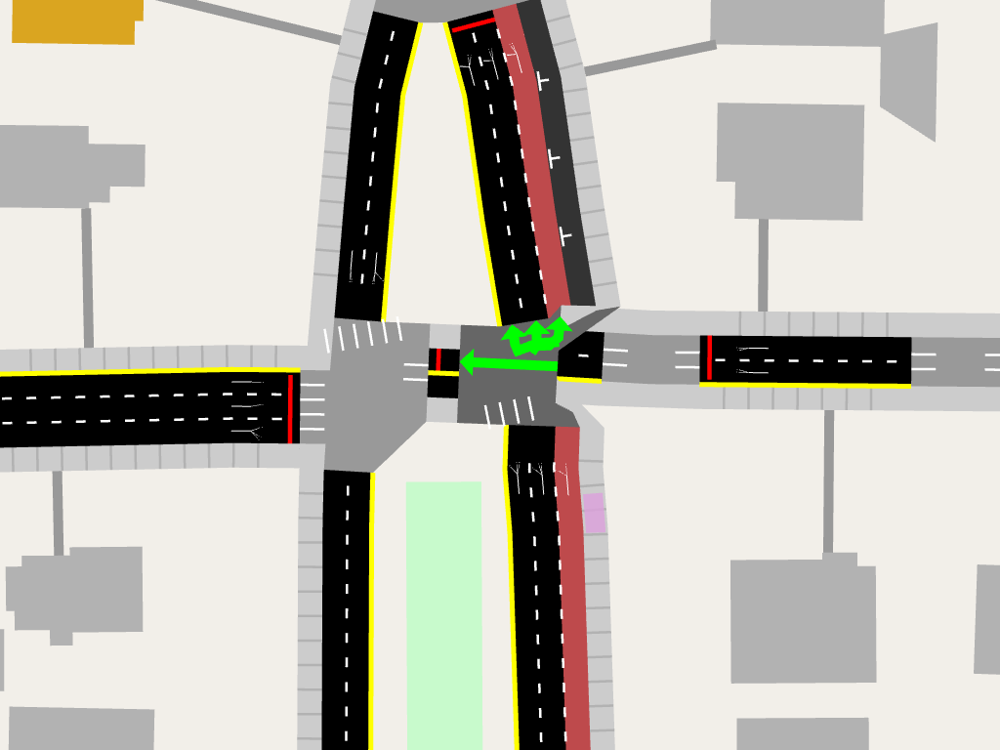
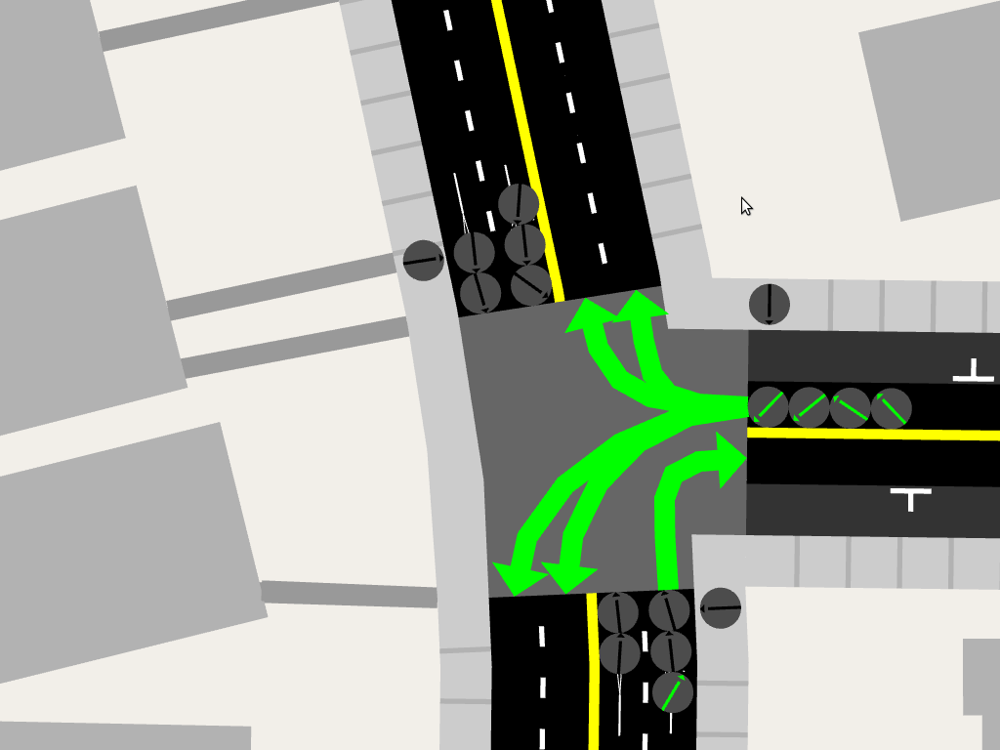

# A/B Street Map Design

link to code

- diagram of data sources and stages
- explanation of intermediate formats
- autogenerate diagrams of the data schemas
- list invariants
- edits

## Features

demonstrate all of these things with before/after pictures or GIFs showing
functionality

### Lanes

- OSM models entire roads coarsely, sometimes with some metadata about the
  presence of bus- or bike-only lanes

- A/B Street breaks roads down into individual lanes
- Sidewalks for pedestrian movement, including bus stops and paths to buildings
- Regular driving lanes, usable by any vehicle
- Bus- or bike-only lanes
- On-street parking lanes, with individual parking spots modeled
- Finding the exact geometry for the lanes from the OSM road center-line is
  automatic. Lane types and number of lanes come from heuristics on OSM metadata
  and extra shapefiles from King County GIS.

### Intersections (geometry)

OSM doesn't explicitly model intersections at all; some ways just share points.

In A/B Street, lanes and intersections have disjoint geometry.

This means that cars and pedestrians stop and queue at the correct position
before crossing an intersection.

The intersection geometry is calculated automatically. It's usually pretty
robust:

But OSM ways often have many "intersections" very close together. These appear
as extremely short roads in A/B Street, which complicates traffic modeling.

These can be merged automatically, which works reasonably well sometimes:

But some cases are very complex; this is Montlake and 520 without merging short
roads:

As of April 2019, short road merging is disabled because it doesn't always work
well:

Some highway on-ramps in OSM are modeled with particularly unusual geometry,
overlapping an arterial road:

A/B Street detects and fixes these cases

### Intersections (semantics)

A/B Street models turns between lanes through intersections. Some turns
conflict. For stop-sign controlled intersections, the bigger road by default has
priority.

Intersections controlled by traffic signals have a default set of timed phases.
Users can edit these.

### Clipping / boundaries

How should the boundary of the map be handled? Without proper clipping, roads
and lakes go out-of-bounds, often with very strange, long roads to nowhere.

Proper clipping trims polygons to fit properly. Roads that cross the boundary
terminate at special border intersections, which can model traffic flowing into
or out of the map.

### Buildings

Light orange buildings are classified as residential, and dark orange as
commercial. Additional data from King County GIS reveals how many units some
apartments have. This will be used to generate a realistic number of trips
between residential and commercial areas.

## Model

The map model is designed for A/B Street's traffic simulation and player
editing, but it likely has other uses.

### Objects

- Road
  - Goes between two Intersections
  - Contains children Lanes in two directions
  - Geometry: a PolyLine representing the yellow line separating the directions
    of travel
    - This is usually the center of the road, except for one-ways or when a road
      has more lanes in one direction.
  - Metadata from OSM
- Lane
  - Belongs to a parent Road
  - Has a LaneType: Driving, Parking, Sidewalk, Biking, Bus
    - Buses and bikes can usually use Driving lanes, but Biking and Bus lanes
      are restricted.
  - Geometry: a PolyLine representing the center of the lane
  - Sidewalks know which Building paths are connected and

borders

<!--

-->

### Edits

### Coordinate system

### Invariants

- min length for lanes, turns
- length for related lanes (sidewalk spot / parking / driving) matching up
- connectivity
  - from any sidewalk to any other
  - from any driving lane to any other
  - no lanechanging needed, because of the turns that exist
- no loop lanes (same src and dst endpt)... but what about cul-de-sacs then?
- associated lanes
  - parking lane or bus stop without driving lane
- all turns renderable by draw_full (making thick polygons can fail)

### Limitations

things not represented

- shared left turn lanes

### Data format

## Data sources

The
[import script](https://github.com/dabreegster/abstreet/blob/master/import.sh)
is the source of truth.

- http://download.bbbike.org/osm/bbbike/Seattle/Seattle.osm.gz
  - OpenStreetMap extract
- https://dds.cr.usgs.gov/srtm/version2_1/SRTM1/Region_01/N47W122.hgt.zip
  - Elevation data, currently unused in the simulation
- https://metro.kingcounty.gov/GTFS/google_transit_2018_18_08.zip
  - Bus stops and routes
- https://data.seattle.gov/Transportation/Traffic-Signals/nr6x-wnd5
  - Location of traffic signals
- https://github.com/seattleio/seattle-boundaries-data/raw/master/data/neighborhoods.geojson
  - Neighborhood boundaries
- http://data-seattlecitygis.opendata.arcgis.com/datasets/blockface
  - Blockfaces, used to determine where on-street parking lanes are
- https://data-seattlecitygis.opendata.arcgis.com/datasets/residential-building-permits-issued-and-final
  - Number of units per residential building

## Conversion process

- raw_data::Map
- HalfMap
- Map

### convert_osm: from data sources to raw_data::Map

- load elevation into memory from a .hgt
- get raw OSM ways from a .osm
- split up OSM ways into roads and intersections
- remove completely disconnected roads
- calculate bounds
- use blockface KML to match parking categories to nearest road and side of the
  road
- match traffic signals from KML to nearest intersection
- load raw bus routes from GTFS
- extract in-bounds neighborhoods from the GeoJSON

### make::half_map: from raw_data::Map to HalfMap

- transform raw intersections to final Intersection struct, and build a map from
  intersection Pt2D to intersection
- transform raw roads to real roads and, using OSM metadata and player edits,
  lanes in both directions, with shifted center lines
- mark border intersections based on metadata and number of incoming and
  outgoing lanes
- create the initial intersection polygons by treating each connected road as a
  thick PolyLine and finding overlaps between adjacent PolyLines
- trim lane center points back by intersecting with intersection polygons
- create all of the turns between incoming and outgoing lanes at each
  intersection
- (unstable and disabled as of 12/21/18) destroy roads shorter than 15m by
  merging intersections and creating longer turns
- recreate each intersection polygon by using the lanes' thick polyline
  endpoints

### Map::create_from_raw: from HalfMap to Map

- assign all turns a numeric index for easy text entry in the UI
- match all bus stops with a sidewalk and adjacent driving/bus lane, and filter
  bus routes based on stops that were successfully assigned
- initialize stop sign-governed intersections with reasonable defaults for which
  roads stop and yield
- initialize traffic signal-governed intersections with reasonable defaults for
  phases
- override intersection defaults with player edits
- create all buildings, matching them to the nearest sidewalk with a front path
- copy over areas (like parks and bodies of water)
- filter out any bus routes with adjacent stops that fail pathfinding

## Conversion tricks

- early roundabout handling
- screenshot diff testing
- stable IDs
- short road trimming
- highway ramp special cases
- intersection polygon calculations
- polyline shifting
- sidewalk corner and crosswalk rendering
- clipping to a boundary polygon
