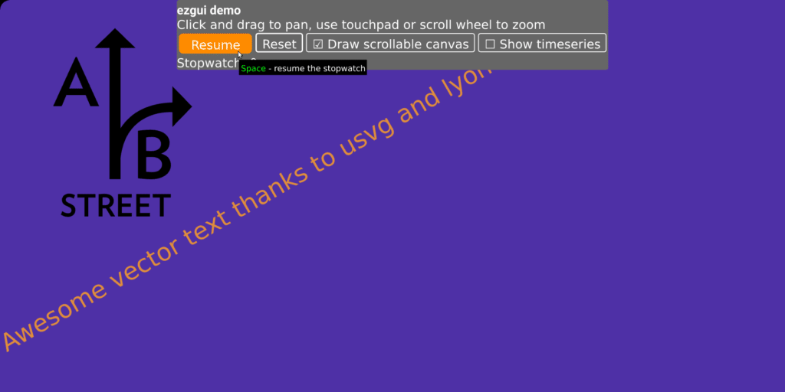

# widgetry notes

Rustwarts School of Glitchcraft and Widgetry.

This is a GUI + 2D drawing + data viz library I've built up for A/B Street. I'm
considering cleaning up the API surface and making it a proper standalone crate.

## Running the demo

Because of wasm-pack issues, normal Rust example binaries don't work. The
example code is instead in the
[widgetry_demo crate](../widgetry_demo/src/lib.rs).

```
git clone https://github.com/dabreegster/abstreet.git
cd abstreet/widgetry_demo
cargo run

# Or for web
cd abstreet/widgetry_demo
./run_web.sh
```



If you want a more thorough idea of what this crate can do, see
[A/B Street](https://abstreet.org).

## Features

### Runs in lots of places

Runs on Linux, Mac, Windows via [glow](https://github.com/grovesNL/glow/). Also
works in the browser using WebAssembly, but text support still coming in
[a few months](https://github.com/RazrFalcon/resvg/issues/229).

Why OpenGL? My requirements are super simple; I don't need the power of Vulkan
or other new stuff. I want something simple that runs everywhere. If you want to
make this work with WGPU or something else, it should be easy. The backends are
a few hundred lines -- [Glow](src/backend_glow.rs) running either
[on native](src/backend_glow_native.rs) or [on wasm](src/backend_glow_wasm.rs).

### 2D drawing

Everything is a colored polygon. Upload stuff once, redraw many times with a
simple camera transform. Panning and smooth zooming. One extremely simple
shader.

Thanks to [usvg](https://github.com/RazrFalcon/resvg) and
[lyon](https://github.com/nical/lyon/), SVGs and text are transformed into
colored polygons. Programatically swap colors, rotate, scale stuff. Find bounds
for precise mouseover.

### GUI

Widgets like buttons (with keybindings), checkboxes, sliders, pop-up menus, text
entry, and some data viz things. You can combine these in `Panel`s to dispatch
event handling and drawing. Styling (background colors, outline, padding) and
Flexbox-ish layouting via [stretch](https://vislyhq.github.io/stretch/).

The API / programming style is kind of funny; see the
[demo](../widgetry_demo/src/lib.rs) to get a sense of it. No callbacks. You
manually feed events into your `Panel`s of widgets and ask about what happened.
There's no smart diffing of widget trees; most of the time it's fine to
completely recreate a `Panel` from scratch when something changes, or replace a
single widget in an existing `Panel`.

(This is not a performance critical library. The perf bottlenecks in A/B Street
are not in the GUI, and I probably won't invest much time speeding things up
here until they are. (Or if somebody else winds up using this library and hits a
problem.))

### Data visualization

Not exactly sure how this wound up in here too, but at some point I needed
histograms and line plots that update live over time and show some info when you
mouseover points, so here it is.

## Big problems to solve before release

When you ask a `Panel` what action happened (what button was clicked), it hands
you back `Option<String>`. Not so typesafe. How boilerplatey is it to associate
buttons with a user-provided enum?

There are hardcoded colors / padding in lots of places. Need to make style
easily configurable, with good defaults.

The error handling is pretty bad; lots of unwraps and panics to clean up.

When returning a `Transition::Replace`, ideally we can consume `self` instead of
just having `&mut self`, so we can avoid cloning stuff from one `State`.

## Why another Rust GUI library?

When I started, nothing did what I needed, or it required awkward callbacks.
Today, [iced](https://github.com/hecrj/iced) looks awesome, but wgpu doesn't
work on my laptop. This is a dealbreaker -- I want to build stuff that runs
~anywhere. I looked into adding an OpenGL backend, but the current structure of
iced has a
[huge](https://github.com/hecrj/iced/blob/master/native/src/renderer/null.rs)
API surface to implement for a new backend.

For the moment, I don't have enough time to get something else on-par with this
library and port A/B Street over, so I'll continue to invest in this library. If
there's lots of interest in other people using this library, I'll invest much
more and make it a real contender.

## Future work

- Draggable panels
